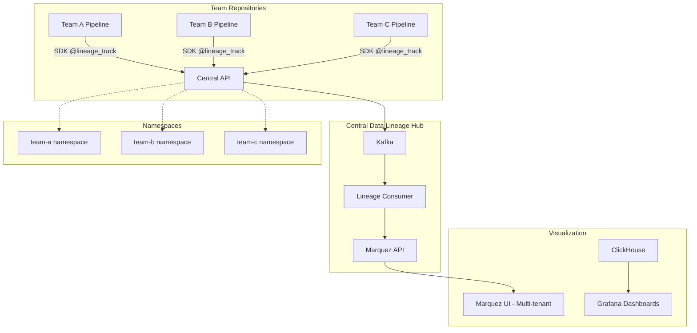
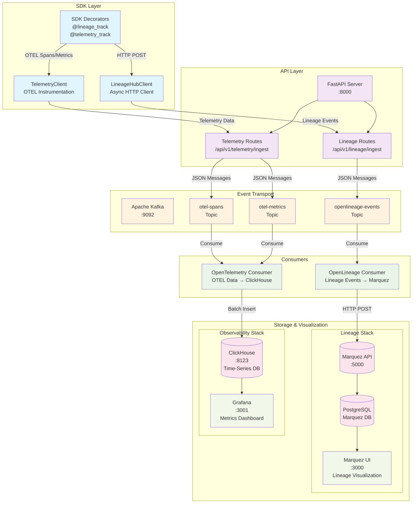

# Data Lineage Hub POC

A comprehensive POC demonstrating a centralized enterprise service for data pipeline observability using **OpenLineage** and **Marquez** for data lineage tracking across multiple teams and repositories.

## 🏗️ Architecture



### **Key Components:**

- **Central API**: Ingestion service for OpenLineage events from team SDKs
- **SDK**: `data-lineage-hub-sdk` with `@lineage_track` decorator for teams
- **OpenLineage**: Standard lineage events → Kafka → Marquez
- **Multi-tenant**: Namespace-based isolation per team/repository
- **ClickHouse**: Optional time-series storage for metrics (Grafana dashboards)
- **Grafana**: Organization-wide pipeline observability dashboards
- **Marquez**: Data lineage visualization with team namespace views

## 📊 Detailed Data Architecture Flow

The system implements a comprehensive dual-track observability architecture with separate flows for data lineage and telemetry:



### Architecture Components

#### **SDK Layer**

- **@lineage_track**: Decorator for automatic data lineage capture with dataset specifications
- **@telemetry_track**: Decorator for OpenTelemetry instrumentation and distributed tracing
- **LineageHubClient**: Async HTTP client for lineage event submission with retry logic
- **TelemetryClient**: OTEL instrumentation client for spans and metrics collection

#### **API Layer**

- **FastAPI Server**: Central ingestion service (port 8000) with OpenAPI documentation
- **Lineage Routes**: `/api/v1/lineage/ingest` - OpenLineage event ingestion with namespace support
- **Telemetry Routes**: `/api/v1/telemetry/ingest` - OTEL data ingestion for spans and metrics

#### **Event Transport**

- **Apache Kafka**: Event streaming platform with namespace-aware partitioning and headers
- **openlineage-events**: Topic for data lineage events with namespace routing
- **otel-spans**: Topic for distributed tracing spans with trace ID correlation
- **otel-metrics**: Topic for application metrics with service name grouping

#### **Consumers**

- **OpenLineage Consumer**: Processes lineage events with immediate forwarding to Marquez
- **OpenTelemetry Consumer**: Batch processes OTEL data with size-based (100) and time-based (30s) flushing

#### **Storage & Visualization**

- **Marquez**: OpenLineage-compatible lineage service with RESTful API (port 5000)
- **PostgreSQL**: Marquez backend database for lineage graph storage
- **ClickHouse**: Time-series database optimized for observability data with Map columns
- **Marquez UI**: Interactive data lineage graph visualization (port 3000)
- **Grafana**: Metrics and tracing dashboards with ClickHouse datasource (port 3001)

### Data Flow Patterns

1. **Lineage Flow**: SDK → FastAPI → Kafka → Consumer → Marquez → PostgreSQL → UI
2. **Telemetry Flow**: SDK → FastAPI → Kafka → Consumer → ClickHouse → Grafana
3. **Multi-tenant Support**: Namespace isolation via Kafka headers and message keys
4. **Batch Processing**: Configurable size-based and time-based flushing for efficiency
5. **Reliability Features**: Async HTTP clients, Kafka delivery callbacks, automatic retry logic
6. **Data Integrity**: Type-safe Pydantic models, comprehensive error handling, structured logging

## 🚀 Quick Start

### Prerequisites

- **Python 3.11+**
- **Poetry** (for dependency management)
- **Docker & Docker Compose** (for infrastructure)

### Install Poetry

If you haven't installed Poetry yet:

```bash
curl -sSL https://install.python-poetry.org | python3 -
# Or visit: https://python-poetry.org/docs/#installation

# Verify installation
poetry --version
```

### Option 1: Complete Setup with Make (Recommended)

```bash
# Complete development setup in one command
make dev-setup

# This will:
# 1. Check Poetry installation
# 2. Create virtual environment (.venv)
# 3. Install all dependencies
# 4. Start infrastructure services
# 5. Install Grafana plugins (ClickHouse datasource)
```

### Option 2: Step-by-Step Setup

```bash
# 1. Create virtual environment and install dependencies
make install-dev

# 2. Start infrastructure services
make start

# 3. Run the API server (in another terminal)
make run-api

# 4. Run consumers (in separate terminals)
make run-lineage-consumer
make run-otel-consumer
```

### Option 3: Using Poetry Directly

```bash
# 1. Create virtual environment and install dependencies
poetry install --with dev

# 2. Start infrastructure
./scripts/start.sh

# 3. Run services using Poetry
poetry run python -m src.main
poetry run python -m src.consumers.lineage_consumer
```

### Option 4: Using Poetry Shell

```bash
# Install dependencies and activate shell
poetry install --with dev
poetry shell

# Now you can run commands directly (no 'poetry run' needed)
python -m src.main
python -m src.consumers.lineage_consumer
```

### Virtual Environment

The project uses Poetry to manage dependencies and virtual environments:

- **Location**: `.venv/` (created in project root)
- **Activation**: `poetry shell` or use `poetry run <command>`
- **Dependencies**: Defined in `pyproject.toml`
- **Dev Dependencies**: Include Ruff, MyPy, Pytest

## 🌐 Access Points

- **API Documentation**: <http://localhost:8000/docs>
- **Marquez UI**: <http://localhost:3000> (Data lineage visualization)
- **Grafana**: <http://localhost:3001> (admin/admin - Pipeline metrics & dashboards)

## 🧪 Testing the Service

```bash
# Test central ingestion API
curl -X POST http://localhost:8000/api/v1/lineage/ingest \
  -H 'Content-Type: application/json' \
  -d '{"namespace": "demo-team", "events": [/* OpenLineage events */]}'

# Check service health
curl http://localhost:8000/api/v1/health

# SDK usage example (from team repositories):
from src.sdk import lineage_track

@lineage_track(
    job_name="data_processing",
    inputs=[{"type": "mysql", "name": "users.table", "format": "table", "namespace": "prod-db"}],
    outputs=[{"type": "s3", "name": "s3://bucket/output.parquet", "format": "parquet", "namespace": "processed"}]
)
def process_data():
    # Team's pipeline logic
    pass
```

## 📁 Project Structure

- `src/` - Central service application code
  - `api/` - FastAPI ingestion API endpoints
  - `consumers/` - Kafka event consumers (lineage processing)
  - `utils/` - Shared utilities and configurations
- `sdk/` - Team SDK package (`data-lineage-hub-sdk`)
  - `data_lineage_hub_sdk/` - SDK source code with decorators
  - `examples/` - SDK usage examples for teams
- `docker/` - Docker configurations for infrastructure
- `dashboards/` - Grafana dashboard configs
- `scripts/` - Setup and utility scripts

## 🔧 Commands

### Make Commands (Recommended)

#### Setup & Environment

```bash
make help                    # Show all available commands
make venv                   # Create Poetry virtual environment
make install                # Install production dependencies
make install-dev            # Install all dependencies (including dev)
make dev-setup              # Complete development setup
```

#### Development

```bash
make run-api                # Run FastAPI server
make run-lineage-consumer   # Run OpenLineage consumer (Kafka → Marquez)
```

#### Code Quality

```bash
make format                 # Format code with Ruff
make lint                   # Lint code with Ruff
make fix                    # Auto-fix code issues with Ruff
make check                  # Run all code quality checks (Ruff + MyPy)
make test                   # Run tests with pytest
```

#### Infrastructure

```bash
make start                  # Start infrastructure services
make setup-grafana-plugins  # Install required Grafana plugins (ClickHouse datasource)
make stop                   # Stop all services
make status                 # Check service status
make logs                   # View service logs
make clean                  # Clean up containers and volumes
```

#### Virtual Environment Management

```bash
make venv-info              # Show virtual environment information
make venv-remove            # Remove Poetry virtual environment
make venv-recreate          # Recreate virtual environment from scratch
```

#### Testing

```bash
make test-pipeline          # Test the sample pipeline
make poetry-check           # Verify Poetry installation
```

### Poetry Commands

```bash
poetry install --with dev   # Install all dependencies
poetry run <command>        # Run command in Poetry environment
poetry shell                # Activate Poetry shell
poetry add <package>        # Add new dependency
poetry remove <package>     # Remove dependency
poetry show                 # Show installed packages
poetry update               # Update dependencies
poetry env info             # Show virtual environment info
poetry env list             # List available environments
poetry config --list       # Show Poetry configuration
```

## 🔧 Development Workflow

### First Time Setup

1. **Clone and setup:**

   ```bash
   git clone <repository-url>
   cd data-lineage-hub
   make dev-setup
   ```

2. **Verify setup:**

   ```bash
   make venv-info          # Check virtual environment
   make poetry-check       # Verify Poetry installation
   poetry show             # List installed packages
   ```

### Daily Development

1. **Activate environment:**

   ```bash
   poetry shell            # Activate Poetry shell
   # OR use poetry run for individual commands
   ```

2. **Code quality checks:**

   ```bash
   make format             # Format code
   make lint               # Check for issues
   make fix                # Auto-fix issues
   make check              # Run all checks
   ```

3. **Testing:**

   ```bash
   make test               # Run unit tests
   make test-pipeline      # Test full pipeline
   ```

### Adding Dependencies

```bash
# Production dependency
poetry add <package>

# Development dependency
poetry add --group dev <package>

# Update pyproject.toml and install
poetry install --with dev
```

## 🐛 Troubleshooting

### Container Startup Issues

#### Kafka Container Fails to Start

- **Symptom**: `ClassNotFoundException: io.confluent.metrics.reporter.ConfluentMetricsReporter`
- **Solution**: This is resolved in the current configuration. If encountered, ensure docker-compose.yml doesn't include Confluent metrics reporter settings.

#### Grafana Container Fails to Start

- **Symptom**: `failed to install plugin grafana-clickhouse-datasource: tls: failed to verify certificate`
- **Solution**: Use the automated plugin installation:

  ```bash
  make setup-grafana-plugins
  ```

- **Manual alternative**:

  ```bash
  docker exec grafana grafana cli plugins install grafana-clickhouse-datasource
  docker restart grafana
  ```

#### General Container Issues

```bash
# Check container status
docker ps -a

# Check specific logs
docker logs <container-name>

# Restart specific service
docker-compose restart <service-name>

# Full restart
make stop && make start
```

### Virtual Environment Issues

```bash
# If virtual environment is broken
make venv-recreate

# Check environment status
make venv-info

# Manual cleanup
poetry env remove --all
rm -rf .venv
make install-dev
```

### Poetry Issues

```bash
# Check Poetry installation
make poetry-check

# Update Poetry
curl -sSL https://install.python-poetry.org | python3 -

# Clear Poetry cache
poetry cache clear --all pypi
```

### Connectivity Issues

- **Kafka not accessible**: Verify port 9092 is open and Kafka is running
- **Marquez UI not loading**: Check PostgreSQL connection and port 3000
- **Grafana login issues**: Default credentials are admin/admin
- **ClickHouse connection**: Verify port 8123 and database initialization
- **API not responding**: Check port 8000 and ensure FastAPI server is running

### Common Issues

1. **"Poetry not found"**: Install Poetry using the official installer
2. **"Virtual environment broken"**: Run `make venv-recreate`
3. **"Dependencies not found"**: Run `poetry install --with dev`
4. **"Ruff/MyPy not working"**: Ensure you're in Poetry environment (`poetry shell`)
5. **"Services not starting"**: Check Docker is running, then run `make start`
6. **"Plugin installation fails"**: Use `make setup-grafana-plugins` after services are running

### VS Code Integration

The project includes VS Code configuration:

- **Settings**: `.vscode/settings.json` (Python interpreter, formatting)
- **Tasks**: `.vscode/tasks.json` (Build, test, lint tasks)
- **Launch**: `.vscode/launch.json` (Debug configurations)
- **Extensions**: `.vscode/extensions.json` (Recommended extensions)
- **Workspace**: `.vscode/data-lineage-hub.code-workspace`

Recommended extensions will be suggested when you open the project.

## 📊 What You'll See

1. **Multi-tenant Data Lineage** in Marquez with namespace-based team views
2. **Team SDK Integration** - Simple decorator usage across different repositories
3. **Real-time Event Processing** through Kafka topics
4. **Organization-wide Dashboards** in Grafana (optional) showing pipeline performance
5. **Cross-team Data Discovery** - Teams can find datasets from other teams (with permissions)

## 🛠️ Technology Stack

### **Central Service Layer**

- **Python 3.11+** with FastAPI for central ingestion API
- **Poetry** for dependency management
- **Ruff** for code formatting and linting

### **SDK Technology**

- **data-lineage-hub-sdk** - Lightweight Python package for teams
- **@lineage_track decorator** - Simple integration pattern
- **Dict-based specifications** - Explicit dataset definitions

### **Data Lineage Stack**

- **OpenLineage** for standardized lineage events
- **Apache Kafka** for lineage event streaming
- **Marquez** for lineage storage and visualization
- **PostgreSQL** for Marquez backend storage

### **Optional Observability Stack**

- **ClickHouse** for metrics storage (time-series data)
- **Grafana** for organization-wide dashboards

### **Infrastructure**

- **Docker & Docker Compose** for containerized services
- **Multi-tenant architecture** with namespace isolation

## 📄 License

This project is licensed under the Apache License 2.0 - see the [LICENSE](LICENSE) file for details.

## 🤝 Contributing

Contributions are welcome! This project demonstrates a centralized enterprise service architecture for data lineage tracking across multiple teams using industry-standard OpenLineage specification.

## 📞 Support

For questions or support, please open an issue in the GitHub repository.
