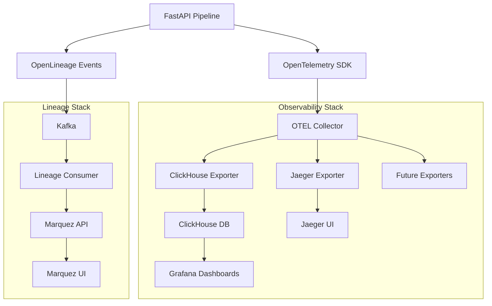

# Data Lineage Hub POC

A comprehensive POC demonstrating data pipeline observability using **OpenLineage** and **Marquez** for data lineage tracking, combined with **OpenTelemetry** for distributed tracing/metrics.

## 🏗️ Architecture



### **Key Components:**
- **FastAPI Pipeline**: Python service with ETL stages
- **OpenLineage**: Standard lineage events → Kafka → Marquez
- **OpenTelemetry**: Metrics & traces → OTEL Collector → Multiple backends
- **OTEL Collector**: Standards-compliant telemetry processing hub
- **ClickHouse**: Time-series storage for metrics (Grafana dashboards)
- **Jaeger**: Distributed tracing visualization
- **Grafana**: Pipeline observability dashboards
- **Marquez**: Data lineage visualization

## 🚀 Quick Start

### Prerequisites

- **Python 3.11+**
- **Poetry** (for dependency management)
- **Docker & Docker Compose** (for infrastructure)

### Install Poetry

If you haven't installed Poetry yet:

```bash
curl -sSL https://install.python-poetry.org | python3 -
# Or visit: https://python-poetry.org/docs/#installation

# Verify installation
poetry --version
```

### Option 1: Complete Setup with Make (Recommended)

```bash
# Complete development setup in one command
make dev-setup

# This will:
# 1. Check Poetry installation
# 2. Create virtual environment (.venv)
# 3. Install all dependencies
# 4. Start infrastructure services
# 5. Install Grafana plugins (ClickHouse datasource)
```

### Option 2: Step-by-Step Setup

```bash
# 1. Create virtual environment and install dependencies
make install-dev

# 2. Start infrastructure services
make start

# 3. Run the API server (in another terminal)
make run-api

# 4. Run consumers (in separate terminals)
make run-lineage-consumer
make run-otel-consumer
```

### Option 3: Using Poetry Directly

```bash
# 1. Create virtual environment and install dependencies
poetry install --with dev

# 2. Start infrastructure
./scripts/start.sh

# 3. Run services using Poetry
poetry run python -m src.main
poetry run python -m src.consumers.lineage_consumer
poetry run python -m src.consumers.otel_consumer
```

### Option 4: Using Poetry Shell

```bash
# Install dependencies and activate shell
poetry install --with dev
poetry shell

# Now you can run commands directly (no 'poetry run' needed)
python -m src.main
python -m src.consumers.lineage_consumer
python -m src.consumers.otel_consumer
```

### Virtual Environment

The project uses Poetry to manage dependencies and virtual environments:

- **Location**: `.venv/` (created in project root)
- **Activation**: `poetry shell` or use `poetry run <command>`
- **Dependencies**: Defined in `pyproject.toml`
- **Dev Dependencies**: Include Ruff, MyPy, Pytest

## 🌐 Access Points

- **API Documentation**: <http://localhost:8000/docs>
- **Marquez UI**: <http://localhost:3000> (Data lineage visualization)
- **Grafana**: <http://localhost:3001> (admin/admin - Pipeline metrics & dashboards)
- **Jaeger UI**: <http://localhost:16686> (Distributed tracing - via OTEL Collector)
- **OTEL Collector**: <http://localhost:4317> (OTLP gRPC), <http://localhost:4318> (OTLP HTTP)

## 🧪 Testing the Pipeline

```bash
# Test sample pipeline
curl -X POST http://localhost:8000/api/v1/pipeline/run \
  -H 'Content-Type: application/json' \
  -d '{"pipeline_name": "sample-etl", "input_path": "data/sample_input.csv", "output_path": "data/output.csv"}'

# Check pipeline status
curl http://localhost:8000/api/v1/metrics
```

## 📁 Project Structure

- `src/` - Main application code
  - `api/` - FastAPI routes and models
  - `pipeline/` - ETL pipeline stages
  - `consumers/` - Kafka event consumers
  - `utils/` - Shared utilities
- `docker/` - Docker configurations
- `data/` - Sample data files
- `dashboards/` - Grafana dashboard configs
- `scripts/` - Setup and utility scripts

## 🔧 Commands

### Make Commands (Recommended)

#### Setup & Environment

```bash
make help                    # Show all available commands
make venv                   # Create Poetry virtual environment
make install                # Install production dependencies
make install-dev            # Install all dependencies (including dev)
make dev-setup              # Complete development setup
```

#### Development

```bash
make run-api                # Run FastAPI server
make run-lineage-consumer   # Run OpenLineage consumer
make run-otel-consumer      # Run OpenTelemetry consumer
```

#### Code Quality

```bash
make format                 # Format code with Ruff
make lint                   # Lint code with Ruff
make fix                    # Auto-fix code issues with Ruff
make check                  # Run all code quality checks (Ruff + MyPy)
make test                   # Run tests with pytest
```

#### Infrastructure

```bash
make start                  # Start infrastructure services
make setup-grafana-plugins  # Install required Grafana plugins (ClickHouse datasource)
make stop                   # Stop all services
make status                 # Check service status
make logs                   # View service logs
make clean                  # Clean up containers and volumes
```

#### Virtual Environment Management

```bash
make venv-info              # Show virtual environment information
make venv-remove            # Remove Poetry virtual environment
make venv-recreate          # Recreate virtual environment from scratch
```

#### Testing

```bash
make test-pipeline          # Test the sample pipeline
make poetry-check           # Verify Poetry installation
```

### Poetry Commands

```bash
poetry install --with dev   # Install all dependencies
poetry run <command>        # Run command in Poetry environment
poetry shell                # Activate Poetry shell
poetry add <package>        # Add new dependency
poetry remove <package>     # Remove dependency
poetry show                 # Show installed packages
poetry update               # Update dependencies
poetry env info             # Show virtual environment info
poetry env list             # List available environments
poetry config --list       # Show Poetry configuration
```

## 🔧 Development Workflow

### First Time Setup

1. **Clone and setup:**

   ```bash
   git clone <repository-url>
   cd data-lineage-hub
   make dev-setup
   ```

2. **Verify setup:**

   ```bash
   make venv-info          # Check virtual environment
   make poetry-check       # Verify Poetry installation
   poetry show             # List installed packages
   ```

### Daily Development

1. **Activate environment:**

   ```bash
   poetry shell            # Activate Poetry shell
   # OR use poetry run for individual commands
   ```

2. **Code quality checks:**

   ```bash
   make format             # Format code
   make lint               # Check for issues
   make fix                # Auto-fix issues
   make check              # Run all checks
   ```

3. **Testing:**

   ```bash
   make test               # Run unit tests
   make test-pipeline      # Test full pipeline
   ```

### Adding Dependencies

```bash
# Production dependency
poetry add <package>

# Development dependency
poetry add --group dev <package>

# Update pyproject.toml and install
poetry install --with dev
```

## 🐛 Troubleshooting

### Container Startup Issues

**Kafka Container Fails to Start**
- **Symptom**: `ClassNotFoundException: io.confluent.metrics.reporter.ConfluentMetricsReporter`
- **Solution**: This is resolved in the current configuration. If encountered, ensure docker-compose.yml doesn't include Confluent metrics reporter settings.

**Grafana Container Fails to Start**
- **Symptom**: `failed to install plugin grafana-clickhouse-datasource: tls: failed to verify certificate`
- **Solution**: Use the automated plugin installation:
  ```bash
  make setup-grafana-plugins
  ```
- **Manual alternative**:
  ```bash
  docker exec grafana grafana cli plugins install grafana-clickhouse-datasource
  docker restart grafana
  ```

**General Container Issues**
```bash
# Check container status
docker ps -a

# Check specific logs
docker logs <container-name>

# Restart specific service
docker-compose restart <service-name>

# Full restart
make stop && make start
```

### Virtual Environment Issues

```bash
# If virtual environment is broken
make venv-recreate

# Check environment status
make venv-info

# Manual cleanup
poetry env remove --all
rm -rf .venv
make install-dev
```

### Poetry Issues

```bash
# Check Poetry installation
make poetry-check

# Update Poetry
curl -sSL https://install.python-poetry.org | python3 -

# Clear Poetry cache
poetry cache clear --all pypi
```

### Connectivity Issues

- **Kafka not accessible**: Verify port 9092 is open and Kafka is running
- **Marquez UI not loading**: Check PostgreSQL connection and port 3000
- **Grafana login issues**: Default credentials are admin/admin
- **ClickHouse connection**: Verify port 8123 and database initialization
- **API not responding**: Check port 8000 and ensure FastAPI server is running

### Common Issues

1. **"Poetry not found"**: Install Poetry using the official installer
2. **"Virtual environment broken"**: Run `make venv-recreate`
3. **"Dependencies not found"**: Run `poetry install --with dev`
4. **"Ruff/MyPy not working"**: Ensure you're in Poetry environment (`poetry shell`)
5. **"Services not starting"**: Check Docker is running, then run `make start`
6. **"Plugin installation fails"**: Use `make setup-grafana-plugins` after services are running

### VS Code Integration

The project includes VS Code configuration:

- **Settings**: `.vscode/settings.json` (Python interpreter, formatting)
- **Tasks**: `.vscode/tasks.json` (Build, test, lint tasks)
- **Launch**: `.vscode/launch.json` (Debug configurations)
- **Extensions**: `.vscode/extensions.json` (Recommended extensions)
- **Workspace**: `.vscode/data-lineage-hub.code-workspace`

Recommended extensions will be suggested when you open the project.

## 📊 What You'll See

1. **OpenLineage Events** in Marquez showing data lineage graphs
2. **OpenTelemetry Traces** and **Metrics** via OTEL Collector to ClickHouse
3. **Metrics & Dashboards** in Grafana showing pipeline performance
4. **Real-time Processing** through Kafka topics

## 🛠️ Technology Stack

### **Application Layer**
- **Python 3.11+** with FastAPI for pipeline execution
- **Poetry** for dependency management
- **Ruff** for code formatting and linting

### **Observability Stack**
- **OpenTelemetry SDK** for metrics and tracing instrumentation
- **OTEL Collector** for telemetry data processing and routing
- **ClickHouse** for metrics storage (time-series data)
- **Grafana** for observability dashboards

### **Data Lineage Stack**
- **OpenLineage** for standardized lineage events
- **Apache Kafka** for lineage event streaming
- **Marquez** for lineage storage and visualization
- **PostgreSQL** for Marquez backend storage

### **Infrastructure**
- **Docker & Docker Compose** for containerized services
- **Nginx** (future) for service routing

## 📄 License

This project is licensed under the Apache License 2.0 - see the [LICENSE](LICENSE) file for details.

## 🤝 Contributing

Contributions are welcome! This project demonstrates modern data pipeline observability patterns using industry-standard tools and protocols.

## 📞 Support

For questions or support, please open an issue in the GitHub repository.
