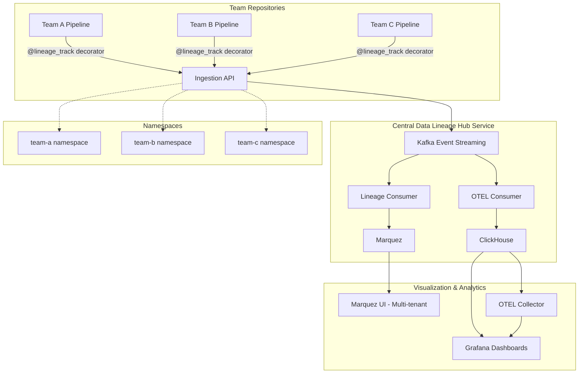

# Data Lineage Hub - Centralized Enterprise Service Architecture

## Overview

The Data Lineage Hub is a **centralized, organization-wide service** for data pipeline observability. It provides a unified platform where multiple teams and repositories can send OpenLineage events and OpenTelemetry data, enabling enterprise-scale data governance and observability.

## Enterprise Architecture Vision



## Core Architectural Principles

### 1. **Centralized Service Model**
- Single deployment serves entire organization
- Teams use lightweight SDK to send data to central service
- Shared infrastructure reduces duplication and operational overhead
- Standardized observability patterns across all teams

### 2. **Multi-Tenant Design** 
- Each team/repository gets isolated OpenLineage namespace
- Data segregation ensures team autonomy
- Shared visualization with team-specific views
- Configurable access controls per namespace

### 3. **Event-Driven Architecture**
- Kafka as high-throughput ingestion backbone
- Decouples data ingestion from processing
- Enables real-time and batch processing patterns
- Built-in durability and replay capabilities

### 4. **Standards-Based Integration**
- OpenLineage specification compliance for data lineage
- OpenTelemetry protocol for observability data
- RESTful APIs for external integrations
- Docker/Kubernetes ready for cloud deployment

## System Components

### 1. Central Ingestion API

#### **Endpoints for External Teams**
```python
# OpenLineage Events from Team Repositories
POST /api/v1/lineage/ingest
{
  "namespace": "team-data-platform",
  "events": [/* OpenLineage events */]
}

# OpenTelemetry Events from Team Repositories  
POST /api/v1/telemetry/ingest
{
  "namespace": "team-ml-platform", 
  "traces": [/* OTLP trace data */],
  "metrics": [/* OTLP metric data */]
}

# Namespace Management
POST /api/v1/namespaces          # Create team namespace
GET  /api/v1/namespaces/{name}   # Get namespace configuration
PUT  /api/v1/namespaces/{name}   # Update namespace settings
```

#### **Internal Pipeline API (Demo/Testing)**
```python
# Internal demo pipeline (for POC purposes)
POST /api/v1/pipeline/run        # Trigger demo ETL pipeline
GET  /api/v1/pipeline/run/{id}   # Get demo execution status
GET  /api/v1/health              # Service health check
```

### 2. Event Streaming Layer

#### **Kafka Topics Architecture**
```yaml
# High-volume ingestion from all teams
openlineage-events:
  description: "OpenLineage events from all team namespaces"
  partitions: 12  # Scaled for org-wide usage
  key: "namespace:run_id"
  retention: 7 days

# Observability data from all teams  
otel-spans:
  description: "OpenTelemetry spans from all team namespaces"
  partitions: 12
  key: "namespace:trace_id" 
  retention: 24 hours

otel-metrics:
  description: "OpenTelemetry metrics from all team namespaces"
  partitions: 12
  key: "namespace:service_name"
  retention: 24 hours
```

#### **Event Processing Patterns**
- **Namespace Routing**: Events automatically routed based on team namespace
- **Schema Validation**: OpenLineage/OTLP spec compliance checking
- **Error Handling**: Dead letter queues for malformed events
- **Rate Limiting**: Per-namespace quotas to prevent resource exhaustion

### 3. Multi-Tenant Storage Layer

#### **Marquez (Lineage Metadata)**
```yaml
Namespace Isolation:
  team-data-platform:
    datasets: ["user_events", "product_catalog"] 
    jobs: ["etl_pipeline", "ml_feature_extraction"]
    access: ["data-platform-team@company.com"]
    
  team-ml-platform:
    datasets: ["training_data", "model_predictions"]
    jobs: ["model_training", "inference_pipeline"] 
    access: ["ml-team@company.com"]

Capabilities:
  - Cross-namespace dataset discovery (with permissions)
  - Namespace-specific lineage graphs
  - Team-isolated job execution history
  - Shared dataset usage analytics across teams
```

#### **ClickHouse (Time-Series Analytics)**
```sql
-- Multi-tenant optimized schema
CREATE TABLE otel.traces (
    timestamp DateTime64(9),
    namespace String,           -- Team namespace
    trace_id String,
    service_name String,
    operation_name String,
    duration_ns UInt64,
    attributes Map(String, String)
) ENGINE = MergeTree()
ORDER BY (namespace, service_name, timestamp)
PARTITION BY toYYYYMM(timestamp);

-- Namespace-aware queries
SELECT namespace, service_name, avg(duration_ns)
FROM otel.traces 
WHERE namespace IN ['team-data-platform', 'team-ml-platform']
GROUP BY namespace, service_name;
```

### 4. SDK & Client Library

#### **Exportable Decorators Package**
```python
# pip install data-lineage-hub-sdk
from data_lineage_hub import lineage_track, configure

# Team configuration (via environment or code)
configure(
    hub_endpoint="https://lineage-hub.company.com",
    namespace="team-data-platform",
    api_key=os.getenv("LINEAGE_HUB_API_KEY")
)

# Same decorator API teams already know
@lineage_track(
    job_name="user_data_etl",
    inputs=["raw_user_events"],
    outputs=["processed_user_data"]
)
def process_user_data(input_path: str) -> str:
    # Team's ETL logic
    return output_path
```

#### **Client Library Features**
```python
class DataLineageHub:
    def __init__(self, endpoint: str, namespace: str, api_key: str):
        self.client = HTTPClient(endpoint, auth=api_key)
        self.namespace = namespace
        
    async def send_lineage_event(self, event: OpenLineageEvent):
        # Automatic namespace tagging
        # Retry logic with exponential backoff
        # Local buffering for offline scenarios
        # Schema validation before sending
        
    async def send_telemetry(self, spans: List[Span], metrics: List[Metric]):
        # OTLP format conversion
        # Batch optimization for high-volume scenarios
        # Compression for network efficiency
```

## Enterprise Data Flow

### 1. **Team Integration Flow**
```
1. Team installs SDK: pip install data-lineage-hub-sdk
2. Team configures namespace: export LINEAGE_NAMESPACE="team-ml"
3. Team adds decorators: @lineage_track to existing pipeline functions
4. Pipeline runs → SDK sends events → Central Hub API
5. Central Hub routes to Kafka topics with namespace tags
6. Consumers process events → Marquez (lineage) + ClickHouse (metrics)
7. Teams view their data in namespace-filtered dashboards
```

### 2. **Cross-Team Data Discovery**
```
1. Team A creates dataset "user_profiles" 
2. OpenLineage event → Central Hub → Marquez with namespace "team-a"
3. Team B searches for "user data" in Marquez UI
4. Marquez shows "user_profiles" (if access permissions allow)
5. Team B can see lineage but not execute/modify (namespace isolation)
6. Optional: Teams can request cross-namespace dataset access
```

### 3. **Organization-wide Observability**
```
1. All teams send OTLP data → Central ClickHouse
2. Platform team creates org-wide Grafana dashboards:
   - Pipeline success rates by team
   - Resource utilization across namespaces  
   - Data quality metrics aggregated by domain
   - SLA compliance tracking per team
3. Teams get both namespace-specific AND org-wide visibility
```

## Multi-Tenant Namespace Architecture

### **Namespace Configuration**
```yaml
# Namespace: team-data-platform
namespace_config:
  name: "team-data-platform"
  display_name: "Data Platform Team"
  
  # Access Control
  owners: ["data-platform-team@company.com"]
  viewers: ["analytics-team@company.com"] 
  
  # Resource Limits
  daily_event_quota: 1000000
  storage_retention_days: 90
  
  # Integrations
  slack_webhook: "https://hooks.slack.com/services/..."
  notification_settings:
    pipeline_failures: true
    data_quality_alerts: true
    
  # Custom Properties
  cost_center: "engineering-data"
  compliance_level: "pci-dss"
```

### **Cross-Namespace Features**
- **Shared Dataset Discovery**: Teams can discover (but not modify) datasets from other namespaces
- **Org-wide Analytics**: Platform teams get aggregated views across all namespaces
- **Compliance Reporting**: Automated compliance reports across team boundaries
- **Resource Optimization**: Shared infrastructure with fair resource allocation

## Deployment Architecture

### **Production Environment**
```yaml
Kubernetes Deployment:
  api_server:
    replicas: 6                    # High availability
    resources:
      requests: { cpu: 1, memory: 2Gi }
      limits: { cpu: 2, memory: 4Gi }
    
  kafka_cluster:
    brokers: 6                     # Scaled for org-wide load
    partitions_per_topic: 12
    replication_factor: 3
    
  consumers:
    lineage_consumer: { replicas: 3 }
    otel_consumer: { replicas: 3 }
    
  storage:
    marquez_postgres: 
      storage: 1TB
      backup_schedule: "daily"
    clickhouse_cluster:
      shards: 3
      replicas: 2
      storage_per_node: 500GB

Monitoring:
  prometheus: "Metrics collection"
  grafana: "Centralized dashboards" 
  alertmanager: "Incident response"
  otel_collector: "Trace aggregation"
```

### **Security Architecture**
```yaml
Authentication:
  api_keys: "Per-team API keys for SDK authentication"
  jwt_tokens: "For web UI access with team scope"
  
Authorization:
  namespace_isolation: "Teams can only access their own data"
  role_based_access: "read-only vs write vs admin per namespace"
  
Network Security:
  tls_everywhere: "All communication encrypted in transit"
  network_policies: "Kubernetes network isolation"
  api_rate_limiting: "Per-team quotas and rate limits"
  
Data Security:
  encryption_at_rest: "All storage encrypted"
  audit_logging: "All API calls logged with team context"
  data_retention: "Configurable per-namespace retention policies"
```

## Scalability & Performance

### **Horizontal Scaling**
- **API Layer**: Stateless services behind load balancer
- **Kafka**: Partition-based scaling for parallel processing  
- **Consumers**: Independent scaling based on topic lag
- **Storage**: ClickHouse clustering, Postgres read replicas

### **Performance Optimizations**
- **SDK Batching**: Client library batches events before sending
- **Compression**: Gzip compression for all API endpoints
- **Caching**: Redis for namespace configuration and frequent queries
- **Async Processing**: Non-blocking I/O throughout the pipeline

### **Reliability Patterns**
- **Circuit Breakers**: Fault tolerance for external dependencies
- **Dead Letter Queues**: Handling of malformed or failed events
- **Health Checks**: Comprehensive monitoring of all components
- **Graceful Degradation**: Service continues with reduced functionality during outages

## Benefits of Centralized Architecture

### **For Teams (SDK Users)**
- **Simple Integration**: Just add decorators and configuration
- **No Infrastructure**: Teams don't manage observability infrastructure
- **Standardized**: Consistent observability patterns across all teams
- **Cross-team Discovery**: Find and understand data from other teams

### **For Platform Teams**
- **Organization-wide Visibility**: Single pane of glass for all data pipelines
- **Operational Efficiency**: One service instead of N observability deployments  
- **Governance**: Centralized data lineage and compliance reporting
- **Cost Optimization**: Shared infrastructure and economies of scale

### **For Leadership**
- **Data Governance**: Complete picture of data movement across organization
- **Compliance**: Automated regulatory reporting and audit trails
- **Resource Optimization**: Understanding of compute and storage usage patterns
- **Innovation**: Teams can focus on business logic instead of observability infrastructure

This centralized architecture transforms data lineage from a per-team concern into an organization-wide capability, enabling data governance, cross-team collaboration, and enterprise-scale observability.